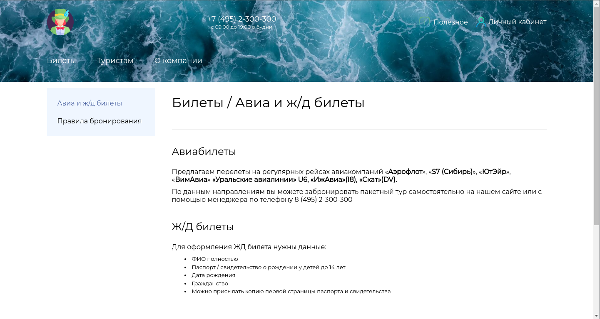

# Диплом на тему: Сайт "Туристическое агентство"

Дизайн сайт был нагло и почти полностью скопирован с реального сайта. 
Но это не страшно, ведь мой "препод" даже не знает, что такое django. У нее
**PHP головного мозга**, где она все еще использует древний HTML. 
На код кстати никто даже и не смотрит, просто главное - **красивый сайт** :).

В моем учебном заведении не учат писать код, а только ебучие отчеты на 30 листов.

# Cайт

## Домашняя страница / Header

## Домашняя страница / Страны

При наведении на сайт, картинка немного зумиться

## Домашняя страница / Достижения и Отзывы

## Домашняя страница / Footer

## Кабинет / Войти

## Кабинет / Регистрация

## Полезное / Страницы с информацией

Только текст меняется на остальных страницах с информацией,
а по структуре все также.
